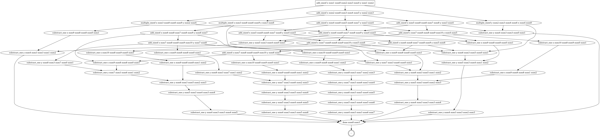
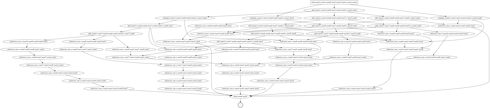
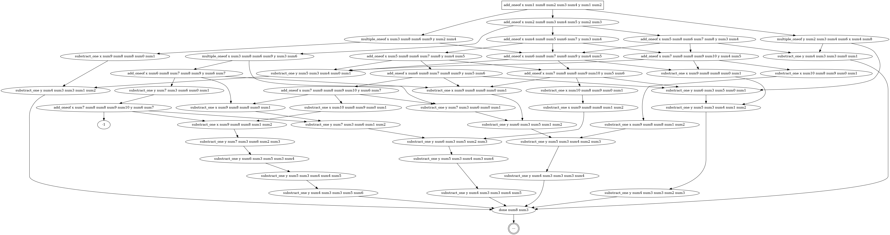
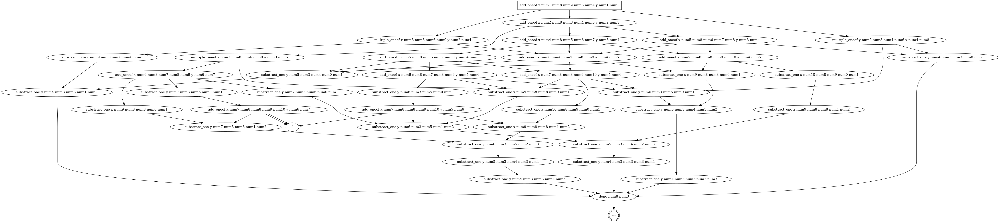
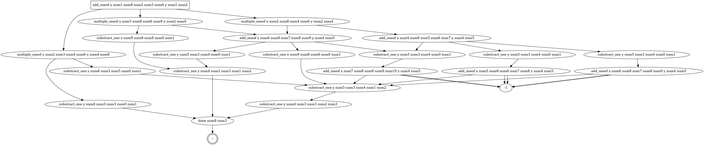
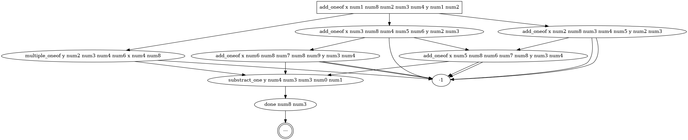

# 813_assn9
This is for Queen's University CISC 813 Course Assignment 9

This is on the topic of Non-deterministic where Assignment 3 I did Pset and Assignmnet 9 is the modelling

# Team members
- E Ching (Noon) Kho, 17eck3@queensu.ca

# Inspiration
This domain was inspired by an idea: can I set up a math equation and the planner try to solve it?

# Problem
There are equations or variables. Each of them starts off with an initial number 1 and they want to reach their goal number through the actions of add, substract, or multiple.

The interesting part is that it is non-deterministic for addition and multiplication action!

Also, an action on a variable will affect another variable if it is "connected" to the variable. 

For the problem setting:
There are 2 equations/variables: x and y, their inital value is 1. 
The goal for x = 8 and y = 3.

There is a simple case and complex case that will further discussed in below sections.

# Domain
## Predicate
There are **11** predicates:
- (current_num ?var - variable ?n - number): the current value for which variable
- (add ?n1 ?n2 ?r - number): add ?n1 with ?n2 and get the result of ?r
- (sub ?n1 ?n2 ?r - number): sub ?n1 with ?n2 and get the result of ?r
- (mul ?n1 ?n2 ?r - number): multiply ?n1 with ?n2 and get the result of ?r
- (greater ?n1 ?n2 - number): ?n1 is greater than ?n2
- (lesser ?n1 ?n2 - number): ?n1 is lesser than ?n2
- (goal ?var - variable ?n - number): the goal value for the variable ?var is ?n
- (solved): the goal state is a solved predicate when all the variables reach their goal values
- (sub_count ?n - number): a counter for the amount of subtraction action can be performed
- (succ ?n1 ?n2 - number): the idea of ++1 for the counter each time the sub action is executed
- (connect ?v1 ?v2 - variable): ?v1 is connected with ?v2, so any actions with performed on ?v1 will affect ?v2

## Action
There are **4** actions:
- add_oneof
- multiple_oneof
- substract_one
- done

### add_oneof
Add the variable with either +1 or +2 or +3 and +1 for the connected variable

It will check if the current num of the variable is less than the goal value (if equal or greater, no point to add). It will check if the number can be added since I put an upper bound so that the maximum value in the problem is 10 and lower bound which the minimum value is 0. Also check if the connected variable(s) can +1 too.

### multiple_oneof
Multiple the variable with either x2 or x3 and x2 for the connected variable

Similar to add_oneof action, check current num of the variable is less than the goal value and will only apply if the result of the multiplications for the variable and connected variable(s) exist.

Also I want the planner to focus on using multiple action more than add and subtract action, thus I set up a total-cost where multiple is cost 1, add is cost 10, subtract is 5

### substract_one
Subtract the variable with -1 (Deterministic, to ensure the planner can reach the goal state)

BUT there is a counter on subtract action, so the planner can't have subtract all the way to reach the goal state, need to "think" about it >:D.

# Problem Setup
There are **3** problems: The actual one, simple, and complex.

## The actual problem
There are **2** equations/variables: x and y
initial: x = 1 and y = 1, (x and y are connected)
goal: x = 8 and y = 3 

## Simple
There is only **1** equation/variable.

For problem_5.pddl,
The initial value for it is 0 and the goal value is 2

For problem_10.pddl,
The inital value for it is 0 and the goal value is 5

There is no limitation on the amount of subtraction action can be performed.

The purpose for it is to check if the add,sub,mul actions work and make sure the predicates are working

## Complex
There are **9** equations/variables: c11, c12, c13, c21, c22, c23, c31, c32, c33
There are connected in a grid 3x3 idea.
The variables all start with initial value 1 and the goal is
c11 = 0, c12 = 1, c13 = 2
c21 = 3, c22 = 9, c23 = 4
c31 = 5, c32 = 7, c33 = 8

I think it is too complex for the planner to solve (remote) and therefore I simplify it to the actual problem.

# Results
In the ./problem.pddl file line 48, I adjust the value of counter which limits the number of times subtract action can be executed.

Here's the result (the count value is tested to see when will the states starting to can't reach the goal state):
## Substract count = 10

## Substract count = 7

## Substract count = 6

## Substract count = 5

## Substract count = 3

## Substract count = 1

## Observations from the images/graphs
When count = 10, it is guarantee to reach the goal state no matter how.
When count = 7, it still able to reach the goal state no matter how.
When count decrease (count <= 6), it is beginning to have states can't reach the goal state.

The total cost really makes the planner try to run multiply action first and then decide to add/sub/mul afterwards.

# Others
Predicates are generated using setup.py

For the done action, I tried to use the forall syntax but since there are a lot of parameters for the add/mul/sub actions and the planner can't really work with the syntax.